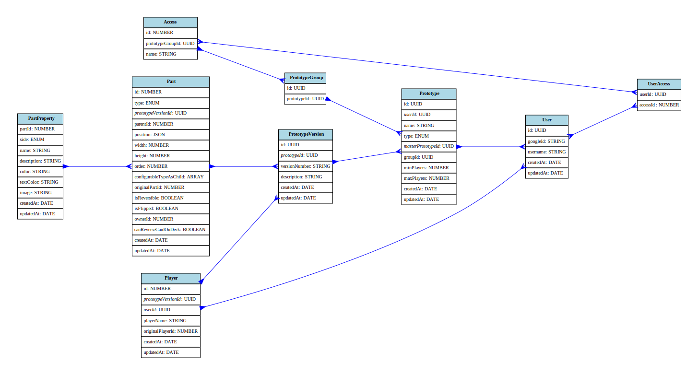

# KIBAKO

## 概要

ボードゲームのプロトタイプを作成するためのアプリケーション

## ドキュメント

- [API 仕様書](https://habitat-hub.github.io/board-game-prototype/)
- [開発ガイド](https://github.com/habitat-hub/board-game-prototype/wiki)

## ディレクトリ構成

- `frontend/`: フロントエンドのソースコード
- `backend/`: バックエンドのソースコード

## セットアップ

### 前提条件

- Node.js
- npm または yarn
- Docker, Docker Compose
- その他必要なツールやライブラリ

### インストール

リポジトリをクローン

```bash
git clone https://github.com/habitat-hub/board-game-prototype.git
cd board-game-prototype
```

### フロントエンドのセットアップ

#### 環境設定

```bash
cp .env_example .env.local
```

#### パッケージのインストール

```bash
cd frontend
npm ci
```

### バックエンドのセットアップ

#### 環境設定

```bash
cp .env_example .env
```

- Google Cloud の API キーを取得して、`.env`ファイルに設定する
- postgres の接続情報が異なる場合は、`.env`ファイルの DATABASE_URL を変更する

#### パッケージのインストール

```bash
cd ../backend
npm ci
```

## 開発サーバー起動方法

### フロントエンド

```bash
cd frontend
npm run dev
```

#### データベース

PostgreSQL サーバーを起動

```bash
cd backend
make start-db
```

PostgreSQL サーバーを停止

```bash
cd backend
make stop-db
```

PostgreSQL サーバーを停止&データ削除

```bash
cd backend
make clean-db
```

補足

「make stop-db」を実行した際にエラーが発生した場合「アクティビティモニター」から postgres と検索しヒットしたものを全て強制終了させてください。

### バックエンド

データベースサーバー起動後に起動してください。

```bash
cd backend
npm run dev
```

## ER 図


